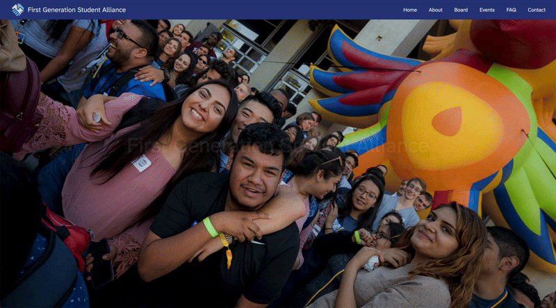

# cce-fgsa-website
A (mock) website for the First Generation Student Alliance club at UCSD. This was created for UCSD CCE 3's Core Assignment 2 as the "collaborative text" portion of the assignment - we chose to recreate the website "genre." 

<div align="center">
  
</div>

## 🌐 Visit

[](https://app.netlify.com/sites/fgsa-at-ucsd/deploys)

This website is being dually hosted on Netlify and on my website! 
- If the badge above is green, the the site is live on Netlify at https://fgsa-at-ucsd.netlify.app.
- Alternatively (and this one should always be up), you can visit it at https://spibble.site/cce-fgsa-website/.

If you want to view or work on it locally, you can follow these steps to set up a dev environment:

1. Clone the repository into a directory of your choosing:
```
git clone https://github.com/spibble/cce-fgsa-website.git
```
2. Install dependencies (i.e., 11ty, Sass):
```
npm install
```
3. Serve the site locally:
```
npm run start
```
4. If everything is well, Eleventy will build the site and then you will see `[11ty] Server at http://localhost:8080/` in your terminal. Here, `http://localhost:8080/` is the URL that the website is being served on, so open it in your web browser and then you can play around with the site!

## 🛠️ Technologies

| Tech                                            | Purpose                                     |
|-------------------------------------------------|---------------------------------------------|
| [Eleventy](https://www.11ty.dev)                | Static site generation, project structure   |
| [Nunjucks](https://mozilla.github.io/nunjucks/) | Page & component templating language        |
| [SCSS](https://sass-lang.com)                   | Styling language (it's just CSS but nicer)  |
| JavaScript                                      | Extra responsiveness, interaction, configs  |
| [Netlify](https://www.netlify.com)              | "Backend" to host the website remotely      |

## 📁 Project Structure

For those who are curious, at a glance, the project looks like this:
```
.
├── src                   
│   ├── _data             // JSON data that gets filled in the components
│   ├── _includes         
│   │   ├── components    // Nunjucks partials for reusable components
│   │   ├── layouts       // Nunjucks partials for pages to extend
│   │   └── words         // Markdown files for long-form written content in pages
│   ├── assets            
│   │   ├── images        // Images and icons for the site
│   │   └── scss          // Stylesheets that get compiled into main.css
│   └── pages             // Nunjucks layouts for each page of the site
├── .eleventy.js          // Eleventy config and rules
└── .package.json         // npm config, scripts, dependencies, etc.
